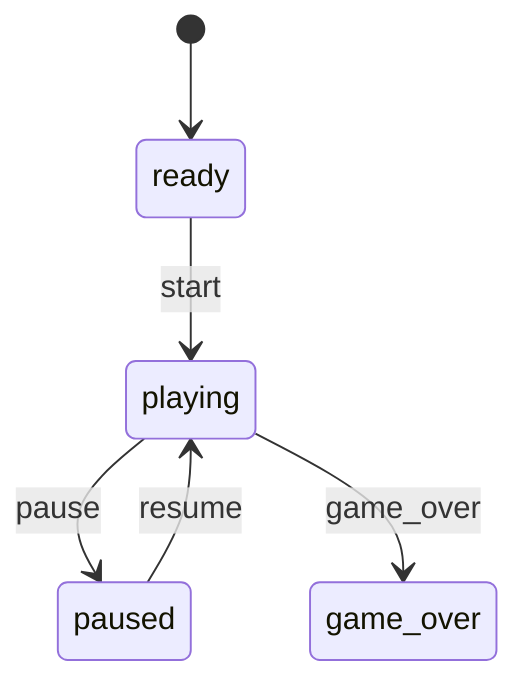

# Getting Started

This project is built using Expo, React Native, Expo Router, and NativeWind.

## Requirements

Before starting, make sure you have installed:

- Node.js (LTS version recommended)
- npm
- Xcode (for iOS development on Mac)
- Android Studio (for Android development)
- Expo Go app on your phone (optional)

---

# Project Setup

## 1. Install Dependencies

Open terminal in the project folder and run:

```bash
npm install
```

---

## 2. Start the Development Server

Run:

```bash
npx expo start
```

This will open the Expo developer tools.

---

# Running the App

## iPhone Simulator

Press:

```bash
i
```

inside the terminal after Expo starts.

You can also open directly from Xcode simulator.

---

## Android Emulator

Press:

```bash
a
```

inside the terminal after Expo starts.

Make sure Android Emulator is already running.

---

## Physical Device

1. Install the Expo Go app
2. Scan the QR code shown in terminal/browser
3. The app will open on your device

---

# Native Build Setup (Outside Expo Go)

This project supports running a full native app build using:

```bash
npx expo run:ios
```

or

```bash
npx expo run:android
```

This creates the native iOS and Android folders automatically.

Use this when:
- Testing native modules
- Using custom native code
- Running libraries that do not work in Expo Go
- Debugging native behavior

---

## First Time Native Setup

### Generate Native Folders

```bash
npx expo prebuild
```

---

## Run iOS App

```bash
npx expo run:ios
```

---

## Run Android App

```bash
npx expo run:android
```

---

# Important Notes About Native Builds

After native folders are created:

```txt
ios/
android/
```

the project becomes a development build workflow instead of pure Expo Go workflow.

If package changes affect native code, run:

```bash
npx expo prebuild
```

again.

---

# Project Structure

```txt
app/            Main application screens and routes
components/     Reusable UI components
assets/         Images, fonts, icons
constants/      Static values and configs
hooks/          Custom React hooks
src/
  components/
    ski-game/   Ski Game module (see below)
```

---

# Ski Game Architecture

The Ski Game lives under `src/components/ski-game/` as a self-contained module. It is designed for **portrait** play: a tall viewport with vertical world scroll (top → bottom), a low-centered player, and a large look-ahead band above the skier for upcoming obstacles.

## Portrait orientation

| Area | Change |
|------|--------|
| `app.json` | `"orientation": "portrait"` locks the app to portrait |
| `app/_layout.tsx` | `SafeAreaProvider` for inset-aware layout |
| `screens/SkiGameScreen.tsx` | Full-screen `flex: 1` root (snow background); safe areas via HUD / pause / overlays only |
| `utils/GameConfig.ts` | Reference size `390 × 844`, player Y band, look-ahead, steer/obstacle ratios |
| Runtime viewport | **SkiGameViewport** `onLayout` → live width/height (fills screen; reference size is config-only) |

**Reference viewport (`390 × 844`):** Used only to tune normalized constants and document layout intent. All spawn math uses the live `engine.viewportRef` from layout.

**Camera / scroll:** Unchanged — world scroll is still vertical (`worldRef.scrollOffsetY` increases downward). In portrait, the player sits at ~82% of viewport height (`PLAYER_START_Y`, default `0.82`), with `PLAYER_LOOKAHEAD_RATIO` documenting the lower band below the anchor. Use `LOOK_AHEAD_VIEWPORT_HEIGHT_RATIO` and `spawnLookAheadOffsetPx()` when placing upstream content.

**Controls:** **TouchControls** + **InputSystem** capture touch in invisible left/right half-screen zones (`STEER_ZONE_DIVIDER_X`). Read `engine.inputRef.current.leftPressed` / `rightPressed` from simulation.

**Obstacle layout:** Patterns respect `OBSTACLE_MIN_SAFE_LANE_WIDTH_RATIO` and `OBSTACLE_MAX_PATTERN_WIDTH_RATIO`, computed via `minSafeLaneWidthPx()` / `maxObstaclePatternWidthPx()` from the live viewport width.

**HUD (portrait):** Hearts, score, and distance top-left; **ActiveEffectDurationHud** top-center (⚡ speed + 🛡 shield bars while active); **PauseButton** top-right (safe area). Metrics from `engine.onFrame` refs only.

## Folder layout

```txt
src/components/ski-game/
  assets/       Game-specific images, sprites, and audio
  components/   Core layout pieces (root shell, background)
  engine/       GameEngine, GameLoop, context, and system registry
  entities/     Entity definitions (Player, etc.)
  hooks/        React hooks tied to the engine lifecycle
  managers/     Session-level coordinators (GameManager)
  screens/      Full-screen entry points (SkiGameScreen)
  services/     Side effects and external integrations (future)
  stores/       Zustand state (use selectors only)
  systems/      GameSystem implementations (PlayerSystem, etc.)
  types/        Shared TypeScript types
  ui/           HUD, overlays, and entity/world renderers
  utils/        Constants and helpers (GameConfig, colors)
  index.ts      Public exports for the module
```

## Runtime composition

1. **SkiGameScreen** — Full-screen **SkiGameRoot** (`flex: 1`, snow background); gameplay viewport is not inset — safe areas apply to HUD / pause / overlays only.
2. **SkiGameRoot** — Creates a **GameEngine** via `useGameEngine`, wraps the tree in **GameEngineProvider**, mounts **SkiGameViewport** for layout and gameplay layers, and renders optional `children`. On first mount, if `gameStateRef.currentState === 'ready'`, calls `requestStartGame(engine)` once (does not run for `paused` or `game_over`; **Play Again** still uses `playAgain(engine)` after `resetGame`).
3. **SkiGameViewport** — Registers core systems (through **SpawnManager**), starts **GameLoop** after layout, and mounts renderers, **Hud**, **TouchControls**, and pause UI. Layout and spawn use one-time React updates only.
4. **GameManager** — Owns the active engine instance for the current session (`createEngine` / `destroyEngine`).
5. **GameEngine** — Holds mutable **refs** (including `spawnRef`, `obstacleRef`), `inputActionsRef`, `runFixedUpdate`, frame listeners, viewport notifications, and **GameSystem** registration.
6. **GameLoop** — `requestAnimationFrame` driver with a fixed timestep accumulator (`FIXED_TIMESTEP`, 60 FPS target). Runs gameplay fixed steps only while `gameStateRef.currentState === 'playing'`; always calls `runGameStateFixedUpdate` when idle/paused/game over, then `engine.notifyFrame` every frame so rendering stays live.
7. **useGameEngineContext** — Access the engine from nested components without prop drilling.

## Game state

High-level flow on `engine.gameStateRef` — pause UI in **Pause** section; game over / restart / menu not implemented.

| File | Role |
|------|------|
| `types/GameStateTypes.ts` | `GameFlowState`, `GameStateRefState`, `PendingGameTransition` |
| `entities/GameState.ts` | Transition requests, `applyPendingGameTransition`, `isGameplaySimulationActive` |
| `systems/GameStateSystem.ts` | Sole owner of `currentState` / `previousState` updates |

**Ref fields:** `currentState`, `previousState`, `pendingTransition`.

**States:** `ready`, `playing`, `paused`, `game_over` (initial: `ready`).

**Request API (sets `pendingTransition` only — never mutates `currentState` directly):**

- `requestStartGame(engine)`
- `requestPauseGame(engine)`
- `requestResumeGame(engine)`
- `requestGameOver(engine)`

**Valid transitions (invalid requests are cleared and ignored):**



**Transition ownership:** Only **GameStateSystem** applies transitions via `applyPendingGameTransition` during its `fixedUpdate`. Gameplay systems must not assign `currentState`; they call the request helpers when needed (**GameOverSystem** → `requestGameOver` when health reaches 0 while `playing`).

**Initial boot:** **SkiGameRoot** `useEffect` requests `ready → playing` on session start. **GameStateSystem** applies the transition on the next **GameLoop** tick; gameplay fixed steps then run as usual. Boot logic lives only in **SkiGameRoot** (not **GameLoop**, **useGameViewport**, or **useGameLoop**).

**Update flow (each animation frame):**

1. **GameLoop** `onFrame` — if `playing`, drain fixed timestep accumulator with `engine.runFixedUpdate` (each step runs **GameStateSystem** first, then all other systems). If not `playing`, call `engine.runGameStateFixedUpdate(0)` once and reset accumulator (no simulation catch-up while idle/paused/game over).
2. **GameStateSystem** — consume `pendingTransition`, update `previousState` / `currentState` when valid.
3. **GameEngine.runFixedUpdate** — after game state step, return early unless `currentState === 'playing'`; otherwise run remaining systems in registration order.
4. **notifyFrame** — always runs; renderers and HUD keep syncing from refs regardless of state.

**Registration order:** **GameStateSystem** is registered first (before **TimeSystem**).

```ts
const { currentState, previousState, pendingTransition } = engine.gameStateRef.current;
```

No allocations during **GameStateSystem** `fixedUpdate`.

## Pause

Pause control and overlay — reads `gameStateRef` only; transitions go through `requestPauseGame` / `requestResumeGame`.

| File | Role |
|------|------|
| `ui/PauseTypes.ts` | Flow index constants, overlay props, placeholder quit handler |
| `ui/PauseButton.tsx` | Top-right control while `playing` → `requestPauseGame` |
| `ui/PauseOverlay.tsx` | Semi-transparent scrim + panel while `paused`; Resume / Quit (placeholder) |

**Pause button**

- Safe-area top-right (`PauseButton`).
- Visible (`display: flex`) only when `currentState === 'playing'` via Reanimated shared value synced on `engine.onFrame`.
- Does not mutate refs except through `requestPauseGame(engine)`.

**Pause overlay**

- Visible only when `currentState === 'paused'`.
- Gameplay + **Hud** stay rendered underneath; world is frozen because **GameLoop** skips gameplay fixed steps while not `playing`.
- **Resume** → `requestResumeGame(engine)`.
- **Quit** → optional `onQuitPress` prop (defaults to `PAUSE_PLACEHOLDER_QUIT`, no navigation yet).
- Blocks touches above **TouchControls** while shown (`zIndex` above steer zones).

**Viewport layer order (bottom → top):**

1. **WorldRenderer** → **ObstacleRenderer** → **CoinRenderer** → **SpeedBoostRenderer** → **ShieldPickupRenderer** → **SnowTrailRenderer** → **CollisionBurstRenderer** → **ShieldShatterRenderer** → **PlayerRenderer** → **ShieldBubbleRenderer**
2. **Hud**
3. **TouchControls**
4. **PauseButton** (playing only)
5. **PauseOverlay** (paused only)
6. **GameOverOverlay** (game over only; above pause — see **Game over**)

No React state for gameplay; no animations, audio, or haptics.

## Game over

Detects zero health during play and shows a summary overlay.

| File | Role |
|------|------|
| `systems/GameOverSystem.ts` | If `playing` and `healthRef.currentHealth <= 0` → cache summary on `gameOverCacheRef`, then `requestGameOver(engine)` |
| `ui/GameOverTypes.ts` | Overlay props, summary/cache helpers, quit placeholder |
| `ui/GameOverOverlay.tsx` | Visible when `game_over`; stats via Reanimated + `engine.onFrame` |

**Gameplay rule:** **GameOverSystem** never assigns `gameStateRef.currentState`; only **GameStateSystem** applies `game_over` from `pendingTransition`.

**Overlay (read-only refs):** `scoreRef`, `timeRef`, `coinRef`, `healthRef` via `readGameOverSummaryFromRefs`. **Play Again** default → `playAgain(engine)` (**Restart**). **Quit** → optional prop (placeholder no-op).

**`engine.gameOverCacheRef`:** snapshot written at game over; cleared by `resetGame`.

**Full viewport layer order (bottom → top):**

1. **WorldRenderer**
2. **ObstacleRenderer**
3. **CoinRenderer**
4. **SpeedBoostRenderer**
5. **ShieldPickupRenderer**
6. **SnowTrailRenderer** (behind player)
7. **CollisionBurstRenderer** / **ShieldShatterRenderer** (impact VFX; behind player)
8. **PlayerRenderer** then **ShieldBubbleRenderer** (when player mounted; bubble above skier, translucent)
6. **PlayerRenderer**
7. **Hud**
8. **TouchControls**
9. **PauseButton**
10. **PauseOverlay**
11. **GameOverOverlay**

While `game_over`, simulation fixed steps stop (same as pause); `notifyFrame` keeps the last frame visible under the overlay.

## Restart

In-place session reset without recreating **GameEngine** or reallocating pool arrays.

| File | Role |
|------|------|
| `entities/restart.ts` | Public `resetGame(engine)` — mutates existing refs and pool slots only |
| `systems/RestartSystem.ts` | Re-exports `resetGame`; `playAgain(engine)` = `resetGame` + `requestStartGame` |

**`resetGame(engine)` order (no allocations):**

1. **Game state** → `ready`, clear `previousState` / `pendingTransition`
2. **Player** → spawn position for current viewport, `velocityX` 0, lean 0, input released
3. **Time** → elapsed, distance, delta, `fixedAccumulatorMs` (see **GameLoop**)
4. **Difficulty** → baseline elapsed, level, multipliers
5. **World / camera** → scroll and offset zero
6. **Health / score / collision** → full health, score 0, no invulnerability; collision cleared
7. **Coins / obstacles / shields / speed boosts** → deactivate every pooled slot in place, `activeCount` 0, reset counters/effects
8. **Spawn manager** → clear pending queue, reset timers/cursors (lane layout preserved)
9. **Game over cache** → cleared

**Play Again:** `GameOverOverlay` calls `playAgain(engine)` when no custom `onPlayAgainPress` is supplied.

**Quit:** still `GAME_OVER_PLACEHOLDER_QUIT` (no navigation).

```ts
import { resetGame, playAgain } from '@/components/ski-game';

resetGame(engine);
requestStartGame(engine); // or playAgain(engine)
```

## World simulation

Simulation state lives in engine refs. React reads layout once; scrolling updates Reanimated shared values on the frame callback.

| File | Role |
|------|------|
| `systems/TimeSystem.ts` | Updates `timeRef`: `elapsedMs`, `deltaMs`, `totalDistance` each fixed step |
| `systems/DifficultySystem.ts` | Advances `difficultyRef` elapsed time and linear ramp multipliers (before scroll/spawn consumers) |
| `systems/WorldSystem.ts` | Increments `worldRef.scrollOffsetY` at `BASE_SCROLL_SPEED` × `difficultyRef.speedMultiplier` × speed-boost multiplier |
| `engine/GameLoop.ts` | Fixed timestep loop (cap on catch-up steps) |
| `hooks/useGameLoop.ts` | Starts/stops the loop when the viewport is ready |
| `ui/WorldRenderer.tsx` | Tiled snow strip; vertical `translateY` from scroll; horizontal `translateX` from `cameraRef` via shared values + `engine.onFrame` |
| `utils/world-coordinates.ts` | `worldYToScreenY` (`scrollOffsetY - worldY`), spawn ahead via `scrollOffsetY + offset`, despawn/render helpers |

**GameConfig:** `BASE_SCROLL_SPEED`, `FIXED_TIMESTEP`, `DIFFICULTY_RAMP_DURATION_MS`, `MAX_DIFFICULTY_SPEED_MULTIPLIER`, `MIN_SPAWN_INTERVAL_MULTIPLIER`, plus portrait tuning (`REFERENCE_VIEWPORT_*`, `LOOK_AHEAD_VIEWPORT_HEIGHT_RATIO`, `PLAYER_LOOKAHEAD_RATIO`, steer/obstacle ratios — see **Portrait orientation**).

**Registration order:** **GameStateSystem** → `TimeSystem` → **DifficultySystem** → `WorldSystem` → `InputSystem` → `PlayerSystem` → `MovementSystem` → `PlayerFeelSystem` → `CameraSystem` → **SpawnManager** → **ObstacleSystem** → **CollisionSystem** → **HealthSystem** → **GameOverSystem** → **CoinSystem** → **ShieldSystem** → **SpeedBoostSystem** (gameplay systems run in `runFixedUpdate` when `playing`).

**Vertical scroll:** **WorldSystem** drives `worldRef.scrollOffsetY` using difficulty and optional speed boost (see **Speed boost**). **SpawnManager** uses `difficultyRef.spawnIntervalMultiplier` for pickup timing only; obstacle density is lookahead-driven (see **Lookahead population**). **TimeSystem** distance still uses base speed only. Look-ahead ratios and spawn helpers are unchanged.

## Difficulty

Time-based ramp stored on `engine.difficultyRef` — no UI, rendering, or changes to pickup/obstacle spawn consumers beyond reading multipliers.

| File | Role |
|------|------|
| `types/DifficultyTypes.ts` | `DifficultyState`, `createInitialDifficultyState`, `syncDifficultyFromElapsed` |
| `systems/DifficultySystem.ts` | Adds `fixedDeltaMs` to `elapsedTimeMs`, recomputes multipliers each fixed step |

**GameConfig (difficulty):**

| Key | Default | Meaning |
|-----|---------|---------|
| `DIFFICULTY_RAMP_DURATION_MS` | `180000` | Linear ramp duration from baseline to caps (3 min) |
| `MAX_DIFFICULTY_SPEED_MULTIPLIER` | `1.6` | Max scroll multiplier from difficulty alone |
| `MIN_SPAWN_INTERVAL_MULTIPLIER` | `0.55` | Min interval multiplier at max difficulty (shorter interval → more spawns) |

**`engine.difficultyRef`:** `elapsedTimeMs`, `currentLevel` (1–10 steps over the ramp), `speedMultiplier`, `spawnIntervalMultiplier`.

**Progression (linear, no jumps):**

Let `t = clamp(elapsedTimeMs / DIFFICULTY_RAMP_DURATION_MS, 0, 1)`.

- `speedMultiplier = 1 + t × (MAX_DIFFICULTY_SPEED_MULTIPLIER − 1)`
- `spawnIntervalMultiplier = 1 + t × (MIN_SPAWN_INTERVAL_MULTIPLIER − 1)`
- `currentLevel` = discrete step 1…10 from `t` (10 at full ramp)

**Pause (future UI):** `requestPauseGame` / `requestResumeGame` drive `playing` ↔ `paused`; fixed simulation and difficulty progression stop while not `playing` because **GameLoop** skips gameplay fixed steps.

**WorldSystem:**  
`scrollStep = BASE_SCROLL_SPEED × difficulty.speedMultiplier × resolveScrollSpeedMultiplier(speedBoostRef) × fixedDeltaMs / 1000`

**SpawnManager:**  
Each fixed step, **`maintainSpawnPopulationAhead`** appends **SpawnPattern** origins upstream until `nextPatternOriginY` reaches the lookahead frontier (see **Lookahead population**). Pickups still use `effectiveSpawnInterval = SPAWN_INTERVAL × difficulty.spawnIntervalMultiplier`.

```ts
const { elapsedTimeMs, currentLevel, speedMultiplier, spawnIntervalMultiplier } =
  engine.difficultyRef.current;
```

No allocations during `fixedUpdate` in **DifficultySystem**.

## Camera

Subtle horizontal follow only; no change to vertical scroll or look-ahead layout above the player.

| File | Role |
|------|------|
| `systems/CameraSystem.ts` | Target offset from player vs viewport center; smooth `cameraRef.offsetX` |
| `types/camera-state.ts` | `CameraState` on `engine.cameraRef` |
| `ui/WorldRenderer.tsx` | Applies `-offsetX` on the world strip; extra horizontal margin (`CAMERA_MAX_OFFSET`) prevents empty edges |

**GameConfig (camera):**

| Key | Default | Meaning |
|-----|---------|---------|
| `CAMERA_HORIZONTAL_FOLLOW` | `0.35` | Fraction of player-center delta applied to camera |
| `CAMERA_SMOOTHING` | `9` | Exponential damping rate toward target offset |
| `CAMERA_MAX_OFFSET` | `48` | Max ±offset (px); world width = viewport + 2× margin |

**Behavior:** Target `offsetX = (playerCenterX - viewportCenterX) × CAMERA_HORIZONTAL_FOLLOW`, clamped to ±`CAMERA_MAX_OFFSET`. Smoothed each fixed step. World strip is wider than the viewport by `2 × CAMERA_MAX_OFFSET` so panning never reveals void. Player screen position and vertical scroll are unchanged. No React state; no allocations in `fixedUpdate`.

## Spawn manager

World-space spawn **requests** only — no entities, rendering, or collision. State lives on `engine.spawnRef`.

| File | Role |
|------|------|
| `managers/SpawnManager.ts` | `GameSystem`: density maintenance + pickup interval into a pre-allocated buffer |
| `managers/SpawnPatterns.ts` | Handcrafted **SpawnPattern** library (data-only) |
| `types/SpawnTypes.ts` | `SpawnKind`, `SpawnRequest`, `SpawnManagerState`, lane/buffer helpers |
| `types/SpawnPatternTypes.ts` | `PatternObstacle`, `SpawnPattern` |
| `utils/spawn-patterns.ts` | Weighted pattern pick, lane/world placement, buffer writes (no alloc) |
| `utils/spawn-population.ts` | Lookahead density count + pattern placement (no alloc) |
| `utils/spawn-validation.ts` | Shared spawn footprints + occupancy checks (pool + pending obstacles) |
| `utils/edge-tree-spawn.ts` | Continuous decorative edge trees (no **SpawnRequest**) |
| `utils/spawn-requests.ts` | `clearPendingSpawnRequests()` for reset |
| `utils/spawn-request-intake.ts` | Stale spawn drop, retain-on-failed-activation, and **clone-on-compact** so pending slots never alias the same object |

**GameConfig (spawn):**

| Key | Default | Meaning |
|-----|---------|---------|
| `SPAWN_INTERVAL` | `1200` | Ms between pickup rotation ticks (`kindCursor` on `SPAWN_KIND_SEQUENCE`) |
| `SPAWN_LOOKAHEAD_DISTANCE` | `600` | World Y lead for initial population cursor (pickups use `POPULATION_LOOKAHEAD`) |
| `PLAYABLE_WORLD_PADDING` | `16` | Horizontal inset for lane layout and spawn X |
| `POPULATION_LOOKAHEAD` | `900` | Extend sequential pattern generation until `nextPatternOriginY` reaches this lead above scroll top |
| `MIN_FORWARD_DENSITY` | `10` | Reserved for future density tuning (sequential fill uses the frontier cursor today) |
| `PATTERN_VERTICAL_SPACING_MIN` / `MAX` | `160` / `320` | Random gap (px) after each pattern’s depth before the next origin (~50% fewer patterns vs prior tuning) |
| `PATTERN_READABILITY_GAP` | `48` | Minimum clear world Y between the previous pattern’s top and the next pattern’s trailing edge |
| `MAX_PATTERNS_PER_FIXED_STEP` | `3` | Cap on pattern appends per simulation step |
| `SPAWN_VALIDATION_PATTERN_MAX_RETRIES` | `3` | Upstream origin bumps when a pattern footprint is occupied |
| `SPAWN_VALIDATION_PICKUP_MAX_SEARCH_ATTEMPTS` | `288` | Hard cap on occupancy probes per pickup placement search |
| `SPAWN_PICKUP_WORLD_Y_SEARCH_BANDS` | `36` | Upstream Y bands scanned from pickup base Y (× retry step) |
| `SPAWN_PICKUP_WORLD_Y_RETRY_STEP` | `36` | World Y offset between pickup placement bands |
| `PICKUP_MIN_VERTICAL_SEPARATION` | `64` | Min \|ΔworldY\| between pickup centers (pending + active) |
| `EDGE_TREE_CLUSTER_SIZE_MIN` / `MAX` | `2` / `4` | Trees per decorative edge cluster (each side) |
| `EDGE_TREE_IN_CLUSTER_SPACING_MIN` / `MAX` | `88` / `124` | Vertical spacing between trees inside a cluster |
| `EDGE_TREE_CLUSTER_GAP_MIN` / `MAX` | `320` / `560` | Open slope (px) after a cluster before the next cluster |
| `DECORATIVE_TREES_ENABLED` | `false` | Master switch: spawn/update/render decorative edge trees (set `true` to re-enable) |
| `EDGE_TREE_MARGIN` | `20` | Gap outside playable corridor (`spawnRef` lane layout) to decorative tree centers |
| `MAX_DECORATIVE_TREES` | `128` | Decorative tree pool (no collision) |
| `MAX_PENDING_SPAWN_REQUESTS` | `72` | Pre-allocated spawn buffer slots |

**Lanes:** Recomputed on viewport layout from playable width (`viewport − 2× padding`) and `OBSTACLE_MIN_SAFE_LANE_WIDTH_RATIO` (3–8 lanes). Pickup kinds use `elapsedSinceLastSpawnMs` + `kindCursor` on `SPAWN_KIND_SEQUENCE` (`obstacle` → `coin` → `obstacle` → `shield` → `obstacle` → `coin` → `obstacle` → `speed_boost`). Each pickup kind (including **speed_boost**) gets its own turn — no coin→boost piggyback. Obstacles come from population maintenance. Each fixed step, **pickup rotation runs before lookahead population** so pickup validation does not treat same-frame obstacle queue rows as occupied.

**Spawn intake:** **ObstacleSystem**, **CoinSystem**, **ShieldSystem**, and **SpeedBoostSystem** remove a **SpawnRequest** from `pending` only after pool activation succeeds. Failed activations stay queued for retry; **`utils/spawn-request-intake.ts`** drops requests whose world Y is already past the below-viewport despawn line (stale / invalid). When compacting the pending buffer, systems **clone** rows into the write index (instead of copying object references) so a later pickup enqueue cannot overwrite an earlier pending coin via shared slot objects.

### Lookahead population (gameplay obstacles)

Every fixed step while lanes are valid, **SpawnManager** extends the mountain **sequentially** — patterns are never inserted at random Y inside terrain that already exists.

1. **`nextPatternOriginY`** on `spawnRef` is the next upstream pattern origin (initialized at `scrollOffsetY + SPAWN_LOOKAHEAD_DISTANCE` on first run / reset).
2. **Lookahead frontier** = `scrollOffsetY + POPULATION_LOOKAHEAD`.
3. While `nextPatternOriginY < frontier`, pick a weighted **SpawnPattern** (up to **`MAX_PATTERN_SELECTION_ATTEMPTS` (5)** fresh weighted picks if placement fails — not the same pattern retried), a random center lane (left / center / right buckets), and expand at **`nextPatternOriginY`** (bumped upward if needed so the next pattern’s vertical range does not overlap the previous pattern’s range).
4. Advance the cursor by **pattern depth** (max `forwardOffset` in that pattern, computed at runtime) plus a random gap in `PATTERN_VERTICAL_SPACING_MIN` … `MAX`.
5. Cap patterns per tick so a single step cannot exhaust the buffer; resume on the next tick if the pending queue is full.
6. Every fourth pattern is forced to **`single_rock`** centered on the middle lane so at least one navigable route remains.

**Spawn validation:** Before any pattern or pickup is queued, **`spawn-validation.ts`** builds a **`SpawnFootprint`** (lanes + world X/Y from existing geometry — pattern entries use **`OBSTACLE_VARIANT_DIMENSIONS`**, not duplicated metadata). **Obstacle patterns:** **`findClearPatternOriginY`** accepts an origin only when **`isSpawnAreaOccupied`** is false (active **`obstacleRef`** slots and pending **`obstacle`** **SpawnRequest** rows) **and** **`isPickupAreaOccupied`** is false (active coin/shield/speed-boost pools plus pending pickup **SpawnRequest** rows, raw footprints — no shield clearance inset). Patterns use validation Y-step retries inside **`findClearPatternOriginY`**; if a pattern still does not fit, **`spawn-population.ts`** discards only that pick and tries another weighted pattern (selection retries). If nothing fits after selection attempts, **`nextPatternOriginY`** advances upstream. **Pickups:** **`findClearPickupSpawn`** scans every lane at the base lookahead Y, then repeats for each upstream Y band (`SPAWN_PICKUP_WORLD_Y_SEARCH_BANDS` × `SPAWN_PICKUP_WORLD_Y_RETRY_STEP`), stopping at the first clear footprint or **`SPAWN_VALIDATION_PICKUP_MAX_SEARCH_ATTEMPTS`** probes (still obstacle-safe, lane-bound, never behind the player). Decorative edge trees skip a slot if occupied (no retries). No allocations in **`fixedUpdate`**.

**Temporary cabin debug:** **`utils/cabin-debug.ts`** (`CABIN_DEBUG_ENABLED`) logs `[CABIN]` events for patterns containing a cabin through population, enqueue, **ObstacleSystem**, and **ObstacleRenderer**; **`logCabinDebugSummary()`** runs on game over. Remove when done investigating.

**Temporary force-cabin debug:** **`utils/spawn-debug.ts`** (`DEBUG_FORCE_CABIN`) places one **`cabin_avoidance`** on the first non-safe population slot per run, then weighted selection resumes. Set flag **`false`** after confirming the red cabin placeholder on screen.

**ObstacleSystem** remains unaware of patterns; it only consumes **SpawnRequest** rows.

### Spawn patterns (data-only library)

Handcrafted **`SpawnPattern`** objects in **`SPAWN_PATTERN_LIBRARY`** (28 patterns) — the only obstacle layout content. Each pattern has **`id`**, **`weight`**, **`difficulty`** (`easy` | `medium` | `hard`), and **`obstacles`** (`variant`, `laneOffset`, `forwardOffset`). Depth-led weaves, gates, S-turns, and chicanes; no full-width walls. **`single_rock`** remains index `0` for periodic safe gaps.

Grouped exports for future weighting (unused by spawn pick today): **`SPAWN_PATTERNS_EASY`**, **`SPAWN_PATTERNS_MEDIUM`**, **`SPAWN_PATTERNS_HARD`**, **`SPAWN_PATTERN_DIFFICULTY_WEIGHT_TOTAL`**.

Adding a pattern = append one **`SpawnPattern`** in **`managers/SpawnPatterns.ts`** (no gameplay system changes).

**Pickup scheduling:** **Coin**, **shield**, and **speed_boost** share `SPAWN_INTERVAL` and advance `kindCursor` on `['obstacle','coin','obstacle','shield','obstacle','coin','obstacle','speed_boost']` (obstacle steps advance cadence only). Relative frequency per cycle: **2 coins : 1 shield : 1 speed_boost**. **`kindCursor` always advances after each pickup tick** (even when enqueue fails or the pending buffer is full). Pickup base world Y uses **`max(POPULATION_LOOKAHEAD, nextPatternOriginY)`**. **`findClearPickupSpawn`** validates against **active obstacles** (not pending obstacle queue rows) and rejects Y bands within **`PICKUP_MIN_VERTICAL_SEPARATION`** of pending or active pickups.

**Consumers:** **ObstacleSystem** uses `request.obstacleVariant` when set; otherwise falls back to the pool’s weighted variant picker. Other systems unchanged.

### Decorative edge trees

Disabled by default via **`DECORATIVE_TREES_ENABLED`** in **GameConfig** (set to `true` to re-enable spawn, **DecorativeTreeSystem**, and **EdgeTreeRenderer**).

| File | Role |
|------|------|
| `types/DecorativeTreeTypes.ts` | Non-colliding tree records + pool |
| `entities/DecorativeTree.ts` | Separate pool from gameplay obstacles |
| `systems/DecorativeTreeSystem.ts` | Continuous edge fill ahead + despawn below viewport |
| `ui/EdgeTreeRenderer.tsx` | Frame-synced placeholders (no collision) |

**DecorativeTreeSystem** fills edge trees each fixed step using **`spawnRef`** playable bounds: left center at `playableOriginX − EDGE_TREE_MARGIN − treeWidth/2`, right center at `playableOriginX + laneWidth × laneCount + EDGE_TREE_MARGIN + treeWidth/2`. Trees whose AABB intersect the corridor are skipped. **Clusters** of 2–4 with in-cluster spacing and **`EDGE_TREE_CLUSTER_GAP_*`** between clusters. No **SpawnRequest**, no collision. Fill cursor on `engine.decorativeTreeRef`. **`EdgeTreeRenderer`** draws the pool (opacity 0.85).

**Reading requests:**

```ts
const spawn = engine.spawnRef.current;
for (let i = 0; i < spawn.pendingCount; i += 1) {
  const request = spawn.requests[i];
  // worldX, worldY, kind, laneIndex, obstacleVariant
}
clearPendingSpawnRequests(spawn);
```

No per-frame allocations; slots are reused in a fixed `MAX_PENDING_SPAWN_REQUESTS` (72) buffer.

## Obstacles

Pooled obstacles in world space (**ObstacleSystem**) with separate presentation (**ObstacleRenderer**) and detection (**CollisionSystem**). No health, shield, or game over yet.

| File | Role |
|------|------|
| `types/ObstacleTypes.ts` | `ObstacleVariant`, `ObstacleRecord`, `ObstaclePoolState`, voxel-ready dimensions |
| `entities/Obstacle.ts` | Pool factory, activate/deactivate, weighted variant picker (LCG, no alloc) |
| `systems/ObstacleSystem.ts` | Spawn intake, despawn below viewport, `engine.obstacleRef` lifecycle only |
| `ui/ObstacleRenderer.tsx` | Fixed `MAX_OBSTACLES` memo slots; Reanimated placeholders (no React state) |
| `utils/obstacle-render.ts` | World → screen transform, viewport culling |

**GameConfig (obstacles):**

| Key | Default | Meaning |
|-----|---------|---------|
| `MAX_OBSTACLES` | `64` | Pooled slots (gameplay + render views) |
| `OBSTACLE_DESPAWN_MARGIN` | `48` | Px below viewport bottom before pool reuse |
| `OBSTACLE_RENDER_MARGIN` | `64` | Culling padding around viewport for draw |
| `SMALL_ROCK_SIZE` | `32×28` | Placeholder footprint (px) |
| `LARGE_BOULDER_SIZE` | `60×54` | |
| `TREE_SIZE` | `48×72` | |
| `TREE_STUMP_SIZE` | `34×30` | |
| `CABIN_SIZE` | `82×74` | |
| `WOODEN_FENCE_SIZE` | `72×22` | |
| `SMALL_ROCK_SPAWN_WEIGHT` | `40` | Weighted random variant |
| `LARGE_BOULDER_SPAWN_WEIGHT` | `20` | |
| `TREE_SPAWN_WEIGHT` | `15` | |
| `TREE_STUMP_SPAWN_WEIGHT` | `15` | |
| `CABIN_SPAWN_WEIGHT` | `5` | |
| `WOODEN_FENCE_SPAWN_WEIGHT` | `5` | |

**Variants:** `small_rock`, `large_boulder`, `tree`, `tree_stump`, `cabin`, `wooden_fence` — sizes from `GameConfig` via `OBSTACLE_VARIANT_DIMENSIONS`; collision and render use each slot’s `width` / `height`.

**Placeholder colors** (`utils/colors.ts`, indexed by `OBSTACLE_VARIANT_RENDER_INDEX`):

| Variant | Color |
|---------|--------|
| Small rock | Gray `#9CA3AF` |
| Large boulder | Dark gray `#4B5563` |
| Tree | Green `#15803D` |
| Tree stump | Brown `#92400E` |
| Cabin | Red `#DC2626` |
| Wooden fence | Orange `#EA580C` |

**Gameplay lifecycle:** SpawnManager → **ObstacleSystem** consumes `obstacle` requests → despawn when past bottom → inactive slots reused (see prior pooling steps).

**Rendering flow:**

1. **SkiGameViewport** layer order: **WorldRenderer** → **ObstacleRenderer** → **CoinRenderer** → **SpeedBoostRenderer** → **ShieldPickupRenderer** → **SnowTrailRenderer** → **CollisionBurstRenderer** → **ShieldShatterRenderer** → **PlayerRenderer** → **GameplayFeedbackRenderer** → **ShieldBubbleRenderer** → **Hud** → **TouchControls** → **PauseButton** → **PauseOverlay** → **GameOverOverlay**.
2. Each frame, `engine.onFrame` updates shared values per fixed slot index (`obstacleRef.obstacles[i]`).
3. Screen rect: center-anchored world position minus `worldRef.scrollOffsetY` and `cameraRef.offsetX`.
4. Culled if outside viewport ± `OBSTACLE_RENDER_MARGIN` (`opacity` 0); inactive slots hidden.
5. No component mount/unmount per frame; pool indices map 1:1 to render slots.

```ts
// Screen placement (see obstacleWorldToScreenRect)
left = worldX - width/2 - cameraOffsetX;
top = worldY - height/2 - scrollOffsetY;
```

## Collision

AABB hit tests in **screen space** only — no obstacle removal; damage is applied by **HealthSystem**.

| File | Role |
|------|------|
| `types/CollisionTypes.ts` | `CollisionState` on `engine.collisionRef` |
| `utils/collision.ts` | `aabbIntersectsWithPadding()` |
| `systems/CollisionSystem.ts` | Resets state each fixed step; first hit wins |

**GameConfig (collision):**

| Key | Default | Meaning |
|-----|---------|---------|
| `PLAYER_COLLISION_PADDING` | `4` | Inset on player box (px) |
| `OBSTACLE_COLLISION_PADDING` | `2` | Inset on obstacle box (px) |

**Flow (each fixed update, after ObstacleSystem):**

1. `resetCollisionState(collisionRef)` → `hasCollision: false`, `obstacleId: 0`, `obstacleType: null`.
2. Player AABB from `playerRef` (screen top-left + size).
3. For each **active** obstacle, world → screen via `obstacleWorldToScreenRect` (scroll + camera).
4. Test AABB overlap with configurable insets; on first hit set `hasCollision`, `obstacleId`, `obstacleType` and **stop**.
5. Does not mutate player, obstacles, or spawn side effects.

```ts
const { hasCollision, obstacleId, obstacleType } = engine.collisionRef.current;
```

**HealthSystem** consumes `collisionRef` only (not `obstacleRef`).

## Health

Run score and per-variant obstacle consequences on `engine.scoreRef` / `engine.healthRef`. **HealthSystem** runs after **CollisionSystem** and applies centralized values from `utils/score-consequences.ts`. Active shield immunity from `engine.shieldRef` still blocks all obstacle consequences (score + health).

| File | Role |
|------|------|
| `types/HealthTypes.ts` | `HealthState` (`currentHealth`, `maxHealth`, invulnerability fields) |
| `types/score-state.ts` | `ScoreState` (`currentScore`, `lastDistanceScoreBucket`; score floored at 0) |
| `utils/score-consequences.ts` | `OBSTACLE_CONSEQUENCES`, `COIN_COLLECT_SCORE`, `DISTANCE_METERS_PER_SCORE_POINT`, `applyScoreDelta`, `applyDistanceScoreProgress` |
| `systems/TimeSystem.ts` | Advances distance; awards silent +1 score per `DISTANCE_METERS_PER_SCORE_POINT` (`25`) meters via `scoreRef` |
| `systems/HealthSystem.ts` | Runs after **CollisionSystem**; applies score + damage from `collisionRef` |

**GameConfig (health):**

| Key | Default | Meaning |
|-----|---------|---------|
| `PLAYER_MAX_HEALTH` | `3` | Starting hearts / max health |
| `PLAYER_INVULNERABILITY_MS` | `1200` | I-frames after a damaging hit (ms) |

**Obstacle consequences (`OBSTACLE_CONSEQUENCES`):**

| Variant | Score | Health |
|---------|-------|--------|
| `small_rock` | −15 | 0 |
| `tree_stump` | −20 | 0 |
| `large_boulder` | −30 | −1 |
| `tree` | −25 | −1 |
| `wooden_fence` | −35 | −1 |
| `cabin` | −50 | −2 |

**Consequence flow (each fixed update, after CollisionSystem):**

1. Tick down `invulnerabilityRemainingMs`; set `isInvulnerable` when &gt; 0.
2. If `!collisionRef.hasCollision`, clear `lastDamagingObstacleId` (overlap ended) and exit.
3. If invulnerable, ignore collision (no score or damage).
4. If `collisionRef.obstacleId === lastDamagingObstacleId`, skip (same obstacle still overlapping).
5. If `shieldRef.isShieldActive`, ignore score + damage but still record `lastDamagingObstacleId` and start `PLAYER_INVULNERABILITY_MS`.
6. Otherwise apply `scoreDelta` via `applyScoreDelta` (`Math.max(0, score + delta)`).
7. If `healthDamage > 0`, subtract (clamped), store `lastDamagingObstacleId`, start invulnerability. Score-only hits (0 HP) do **not** start i-frames.

**Feedback:** While `isInvulnerable`, **PlayerRenderer** alternates opacity 1.0 / 0.35 on a 60 ms / 60 ms square wave derived from `invulnerabilityRemainingMs` (no extra timer).

```ts
const {
  currentHealth,
  maxHealth,
  isInvulnerable,
  invulnerabilityRemainingMs,
} = engine.healthRef.current;
const { currentScore } = engine.scoreRef.current;
```

Internal `lastDamagingObstacleId` prevents multi-tick score or damage from one overlap. After separating from an obstacle, a new overlap can apply consequences again once i-frames allow (or immediately for score-only obstacles).

## Coins

Pooled collectibles — gameplay in **CoinSystem**, visuals in **CoinRenderer** (no audio or collection VFX).

**Investigation archive (symptoms, prompts, fixes, open issues):** [`docs/COIN-PROBLEMS-INVESTIGATION.md`](docs/COIN-PROBLEMS-INVESTIGATION.md).

| File | Role |
|------|------|
| `types/CoinTypes.ts` | `CoinRecord`, `CoinPoolState`, `COIN_WORLD_SIZE` |
| `entities/Coin.ts` | Pool factory, spawn/activate/deactivate/collect helpers, `coinWorldToScreenRect` |
| `systems/CoinSystem.ts` | Spawn intake, AABB collection, despawn, `engine.coinRef` |
| `utils/coin-render.ts` | Viewport culling helpers |
| `ui/CoinRenderer.tsx` | Fixed `MAX_COINS` memo slots; Reanimated atlas sprite (~12 FPS loop from `texture.json` / `texture.png`) |

**GameConfig (coins):**

| Key | Default | Meaning |
|-----|---------|---------|
| `MAX_COINS` | `24` | Pooled slots (gameplay + render views) |
| `COIN_DESPAWN_MARGIN` | `48` | Px below viewport before reuse |
| `COIN_COLLISION_PADDING` | `4` | Inset on coin box for collection |
| `COIN_RENDER_MARGIN` | `64` | Culling padding around viewport for draw |

**`engine.coinRef`:** `coins[]`, `activeCount`, `totalCoinsCollected`, `nextCoinId`.

**Pooling lifecycle (gameplay):**

1. Mount allocates `MAX_COINS` inactive `CoinRecord` entries.
2. Each fixed step: compact `spawnRef` — only `kind === 'coin'` spawns into free slots; other kinds preserved for other systems.
3. World position from spawn request (`worldX`, `worldY` center-anchored for hit/render math). **`resolveCoinActivationWorldY`** re-anchors `worldY` upstream at pool activation if scroll has overtaken the enqueue-time Y so coins enter the viewport band before despawn.
4. **Collection:** Player screen AABB vs coin screen rect (`scroll` + `camera`); uses `PLAYER_COLLISION_PADDING` + `COIN_COLLISION_PADDING`; on hit → `applyScoreDelta(+COIN_COLLECT_SCORE)`, deactivate slot, `totalCoinsCollected += 1`.
5. **Despawn:** When `worldY - scrollOffsetY > viewportHeight + COIN_DESPAWN_MARGIN`, return slot to pool (uncollected).

```ts
const { totalCoinsCollected, activeCount, coins } = engine.coinRef.current;
```

**Rendering flow:**

1. **SkiGameViewport** draws coins **above ObstacleRenderer** and **below PlayerRenderer**.
2. Each frame, `engine.onFrame` updates shared values per fixed slot index (`coinRef.coins[i]`).
3. Screen rect: `coinWorldToScreenRect` — center-anchored world position minus `worldRef.scrollOffsetY` and `cameraRef.offsetX`.
4. Culled if outside viewport ± `COIN_RENDER_MARGIN` (`opacity` 0); inactive slots hidden.
5. **Atlas animation:** `assets/assets/Coin Animations/texture.png` + `texture.json` (TexturePacker frames sorted **1–24**); clip + translate crop at **~12 FPS** from `timeRef.elapsedMs`; drawn at `COIN_WORLD_SIZE` (28×28 world box).
6. No component mount/unmount per frame; pool indices map 1:1 to render slots.

No allocations during `fixedUpdate` in **CoinSystem**.

## Snow trail (visual)

Lightweight ski spray behind the player — **presentation only**; no gameplay or engine systems changes.

| File | Role |
|------|------|
| `effects/SnowTrail.ts` | Fixed pool (`MAX_SNOW_PARTICLES` 64), spawn/update tick, world→screen helpers |
| `ui/SnowTrailRenderer.tsx` | Pooled memo slots; Reanimated white dots |

**Behavior:**

1. Spawns only while `gameStateRef.currentState === 'playing'` (~2 particles / **64 ms** just **below** the player placeholder, offset toward **left/right skis** outside the body).
2. Pool stored per `GameEngine` via `WeakMap` (no new `GameEngine` refs).
3. **SnowTrailRenderer** registers `tickSnowTrail` on `engine.onFrame` (frame delta); slots sync shared values after tick (same pattern as pickup renderers).
4. Particles use world X/Y + scroll/camera for screen position; lifetime **490–630 ms** with drift, shrink, and fade (peak opacity **1.0**).
5. Placeholder: **6–10 px** rounded light-blue snow dots (`snowTrailDot`); no images/SVG/canvas.
6. Layer: **above pickups**, **below PlayerRenderer**.

No allocations during `tickSnowTrail` / render sync.

## Impact VFX (visual)

Short-lived pooled bursts — **presentation only**; gameplay systems unchanged.

| File | Role |
|------|------|
| `effects/CollisionBurst.ts` | Pool (64), spawn on new obstacle overlap (`collisionRef`), tick + world→screen |
| `effects/GameplayFeedback.ts` | Fixed pool (6), score/heart floaters at player screen position on applied consequences |
| `effects/ShieldShatter.ts` | Pool (64), spawn when shield drops while colliding (post-**ShieldSystem** consume), tick + world→screen |
| `ui/CollisionBurstRenderer.tsx` | Snow kick-up fragments at impact |
| `ui/GameplayFeedbackRenderer.tsx` | Floating `±SCORE` / `−HEART(S)` feedback (Reanimated fade + rise) |
| `ui/ShieldShatterRenderer.tsx` | Cyan shatter fragments at player |

**Collision burst:** Observes `collisionRef.hasCollision` + new `obstacleId` (once per overlap). Spawns **8–12** light snow fragments at player impact; lifetime **250–350 ms**.

**Shield shatter:** Observes `previousShieldActive && !isShieldActive && hasCollision` after fixed updates (shield consumed on hit, not timer-only expiry in normal play). Spawns **10–14** cyan fragments; lifetime **300–400 ms**.

Both use `engine.onFrame` ticks (frame delta), Reanimated pooled slots, and `WeakMap` pools per `GameEngine` (same style as **Snow trail**).

## Shield

Pooled shield pickups and timed collision immunity — gameplay in **ShieldSystem**, world pickup visuals in **ShieldPickupRenderer**, active shield bubble in **ShieldBubbleRenderer**, duration bar in **ActiveEffectDurationHud**.

| File | Role |
|------|------|
| `types/ShieldTypes.ts` | `ShieldRecord`, `ShieldPoolState`, `SHIELD_WORLD_SIZE` |
| `entities/Shield.ts` | Pool factory, spawn/deactivate/collect helpers, `activateShieldEffect` / `consumeShieldEffect`, `shieldWorldToScreenRect`, duration tick |
| `systems/ShieldSystem.ts` | Spawn intake, AABB collection, despawn, effect countdown, one-hit consume on obstacle collision, `engine.shieldRef` |
| `utils/shield-render.ts` | Viewport culling helpers |
| `ui/ShieldPickupRenderer.tsx` | Fixed `MAX_SHIELDS` memo slots; Reanimated atlas sprite (~12 FPS loop from `shield-sprite.json` / `shield-sprite.png`) |
| `ui/ShieldBubbleRenderer.tsx` | Protective bubble on player while `isShieldActive` (Reanimated pulse) |

**GameConfig (shield):**

| Key | Default | Meaning |
|-----|---------|---------|
| `MAX_SHIELDS` | `12` | Pooled pickup slots (allocated once at mount) |
| `SHIELD_DURATION_MS` | `4000` | Immunity duration after collection (ms); aligned with speed boost |
| `SHIELD_DESPAWN_MARGIN` | `48` | Px below viewport before pickup reuse |
| `SHIELD_COLLISION_PADDING` | `4` | Inset on pickup AABB for collection |
| `SHIELD_RENDER_MARGIN` | `64` | Culling padding around viewport for pickup draw |

**`engine.shieldRef`:** `shields[]`, `activeCount`, `nextShieldId`, `isShieldActive`, `remainingShieldMs`.

**Pooling lifecycle (gameplay):**

1. Mount allocates `MAX_SHIELDS` inactive `ShieldRecord` entries.
2. Each fixed step: compact `spawnRef` — only `kind === 'shield'` spawns into free slots; other kinds preserved.
3. **Collection:** Player screen AABB vs pickup screen rect (`scroll` + `camera`); on hit → deactivate slot, set `isShieldActive = true`, `remainingShieldMs = SHIELD_DURATION_MS`.
4. **Despawn:** When `worldY - scrollOffsetY > viewportHeight + SHIELD_DESPAWN_MARGIN`, return uncollected slot to pool.
5. **Duration:** `tickShieldDuration` each fixed update; when `remainingShieldMs` reaches 0, `consumeShieldEffect` clears the effect.
6. **One-hit absorb:** After **HealthSystem** (same fixed step), if `isShieldActive` and `collisionRef.hasCollision`, **ShieldSystem** calls `consumeShieldEffect`. **HealthSystem** already marked the obstacle and started invulnerability when the shield blocked damage, so overlap on later fixed steps does not re-apply damage.

**Shield pickup rendering:**

1. **SkiGameViewport** draws shield pickups **above SpeedBoostRenderer** and **below PlayerRenderer**. Shield enqueue placement uses full obstacle occupancy (active + pending) plus **`SHIELD_PICKUP_SPAWN_CLEARANCE`** so pickups avoid grey rocks.
2. Each frame, `engine.onFrame` updates shared values per fixed slot index (`shieldRef.shields[i]`).
3. Screen rect: `shieldWorldToScreenRect` — same center-anchored math as collection in **ShieldSystem**.
4. Culled if outside viewport ± `SHIELD_RENDER_MARGIN` (`opacity` 0); inactive slots hidden.
5. **Atlas animation:** `assets/assets/Shield Animations/shield-sprite.png` + `shield-sprite.json` (TexturePacker frames sorted **1–25** by name, not atlas grid order); clip + translate crop at **~12 FPS** from `timeRef.elapsedMs`; drawn contain-fit inside `SHIELD_WORLD_SIZE` (32×32 world box — gameplay geometry unchanged).

**Shield bubble (presentation):**

1. **ShieldBubbleRenderer** mounts **above** **PlayerRenderer** (translucent bubble over the skier).
2. Each frame, `engine.onFrame` reads `shieldRef.isShieldActive`, `playerRef.x`, and `playerFeelRef.leanAngle` (same sync as **PlayerRenderer**).
3. Circle diameter unchanged: **`2 × 1.35 × PLAYER_WIDTH`**, centered on the player placeholder.
4. **Fill** ~40% sky-blue alpha; **4 px** bright border (lighter than fill); optional **outer glow ring** (semi-transparent border, no blur).
5. Breathing pulse: scale **1.00 → 1.08 → 1.00** over **1 s** via `timeRef.elapsedMs` (Reanimated shared values; hidden when inactive).

**Health interaction:** **HealthSystem** checks `shieldRef.isShieldActive` before applying obstacle damage; when the shield blocks a hit it sets `lastDamagingObstacleId` and invulnerability without −1 HP. **ShieldSystem** runs after **HealthSystem** each step and consumes the timed effect on that obstacle collision.

```ts
const { isShieldActive, remainingShieldMs, activeCount, shields } = engine.shieldRef.current;
```

No allocations during `fixedUpdate` in **ShieldSystem**.

## Speed boost

Pooled speed boost pickups and timed scroll multiplier — gameplay in **SpeedBoostSystem**, pickup visuals in **SpeedBoostRenderer**, active effect bars in **ActiveEffectDurationHud** (mounted from **Hud**).

| File | Role |
|------|------|
| `types/SpeedBoostTypes.ts` | `SpeedBoostRecord`, `SpeedBoostPoolState`, `SPEED_BOOST_WORLD_SIZE` |
| `entities/SpeedBoost.ts` | Pool factory, spawn/deactivate/collect helpers, `speedBoostWorldToScreenRect`, duration tick, `resolveScrollSpeedMultiplier` |
| `systems/SpeedBoostSystem.ts` | Spawn intake, AABB collection, despawn, effect countdown, `engine.speedBoostRef` |
| `utils/speed-boost-render.ts` | Viewport culling helpers |
| `ui/SpeedBoostRenderer.tsx` | Fixed `MAX_SPEED_BOOSTS` memo slots; Reanimated atlas sprite (~12 FPS loop from `speed-boost-sprite.json` / `speed-boost-sprite.png`) |
| `ui/ActiveEffectDurationHud.tsx` | Top-center ⚡ speed + 🛡 shield duration bars (see **HUD**) |

**GameConfig (speed boost):**

| Key | Default | Meaning |
|-----|---------|---------|
| `MAX_SPEED_BOOSTS` | `12` | Pooled pickup slots (allocated once at mount) |
| `SPEED_BOOST_DURATION_MS` | `4000` | Boost duration after collection (ms); refreshed on re-collection |
| `SPEED_BOOST_MULTIPLIER` | `1.75` | Applied to `BASE_SCROLL_SPEED` while active |
| `SPEED_BOOST_DESPAWN_MARGIN` | `48` | Px below viewport before pickup reuse |
| `SPEED_BOOST_COLLISION_PADDING` | `4` | Inset on pickup AABB for collection |
| `SPEED_BOOST_RENDER_MARGIN` | `64` | Culling padding around viewport for draw |

**Spawn scheduling:** **SpawnManager** enqueues **`speed_boost`** on its own `SPAWN_KIND_SEQUENCE` turn (independent of coin; shares `SPAWN_INTERVAL ×` difficulty timing). Intake, collection, effect, and despawn are unchanged below.

**`engine.speedBoostRef`:** `speedBoosts[]`, `activeCount`, `nextSpeedBoostId`, `isSpeedBoostActive`, `remainingSpeedBoostMs`, `speedMultiplier` ( `1` when inactive).

**Pooling lifecycle (gameplay):**

1. Mount allocates `MAX_SPEED_BOOSTS` inactive `SpeedBoostRecord` entries.
2. Each fixed step: compact `spawnRef` — only `kind === 'speed_boost'` spawns into free slots; other kinds preserved.
3. **Collection:** Player screen AABB vs pickup screen rect (`scroll` + `camera`); on hit → deactivate slot, set `isSpeedBoostActive = true`, `remainingSpeedBoostMs = SPEED_BOOST_DURATION_MS`, `speedMultiplier = SPEED_BOOST_MULTIPLIER` (refreshes duration if already active).
4. **Despawn:** When `worldY - scrollOffsetY > viewportHeight + SPEED_BOOST_DESPAWN_MARGIN`, return uncollected slot to pool.
5. **Duration:** `tickSpeedBoostDuration` each fixed update; when `remainingSpeedBoostMs` reaches 0, clear effect and set `speedMultiplier = 1`.

**Rendering flow:**

1. **SkiGameViewport** draws speed boost pickups **above CoinRenderer** and **below PlayerRenderer**.
2. Each frame, `engine.onFrame` updates shared values per fixed slot index (`speedBoostRef.speedBoosts[i]`).
3. Screen rect: `speedBoostWorldToScreenRect` — same center-anchored math as collection in **SpeedBoostSystem**.
4. Culled if outside viewport ± `SPEED_BOOST_RENDER_MARGIN` (`opacity` 0); inactive slots hidden.
5. **Atlas animation:** `assets/assets/Thunder Animations/speed-boost-sprite.png` + `speed-boost-sprite.json` (TexturePacker frames sorted by numeric name; same clip-viewport strategy as **ShieldPickupRenderer**); ~12 FPS from `timeRef.elapsedMs`; contain-fit centered inside `SPEED_BOOST_WORLD_SIZE` (32×32 — gameplay geometry unchanged).

**WorldSystem interaction:** Each fixed step, **WorldSystem** reads `difficultyRef.speedMultiplier` and `resolveScrollSpeedMultiplier(speedBoostRef)`, then scrolls by `(BASE_SCROLL_SPEED × difficulty × boost × fixedDeltaMs) / 1000`. **SpeedBoostSystem** runs later in the same frame (countdown and collection), so a pickup collected mid-frame applies boosted scroll on the **next** fixed step; expiry may apply boost for one extra scroll step on the frame duration hits zero.

```ts
const {
  isSpeedBoostActive,
  remainingSpeedBoostMs,
  speedMultiplier,
  activeCount,
  speedBoosts,
} = engine.speedBoostRef.current;
```

No allocations during `fixedUpdate` in **SpeedBoostSystem**.

## HUD

Read-only overlay for hearts, score, distance, and active speed/shield duration bars — no gameplay mutations, no game over / pause chrome, no collection VFX or particles.

| File | Role |
|------|------|
| `ui/Hud.tsx` | Layout + `engine.onFrame` → Reanimated shared values |
| `ui/ActiveEffectDurationHud.tsx` | Top-center ⚡ speed + 🛡 shield countdown bars |
| `ui/SpeedBoostDurationHud.tsx` | Re-exports **ActiveEffectDurationHud** (compat) |
| `ui/HudStyles.ts` | Minimal styles, inset constants |
| `ui/HudTypes.ts` | `HudMetricValues`, `HudSafeAreaLayout` (documentation / future use) |

**Data flow (each display frame):**

1. **TimeSystem** advances `engine.timeRef.current.totalDistance` (world scroll / run distance) and awards passive distance score on `scoreRef` (+1 per `DISTANCE_METERS_PER_SCORE_POINT` meters; no GameplayFeedback).
2. **HealthSystem** maintains `engine.healthRef.current.currentHealth` and applies obstacle score penalties.
3. **CoinSystem** increments `engine.coinRef.current.totalCoinsCollected` and `engine.scoreRef.current.currentScore` on collection.
4. **Hud** subscribes once via `engine.onFrame` and copies those ref fields into shared values (`currentHealth`, `currentScore`, `totalDistance`) — **no React state** for gameplay numbers.
5. **HudHeart** toggles heart opacity from `currentHealth`; **HudNumberField** uses `useAnimatedProps` on a non-editable `TextInput` for score and distance (`m` suffix).
6. **ActiveEffectDurationHud** mirrors `speedBoostRef` and `shieldRef` (`isSpeedBoostActive` / `remainingSpeedBoostMs`, `isShieldActive` / `remainingShieldMs`) into shared values; fill widths use **GameConfig** durations (no duplicate timers).

**Layout:**

- Safe area: `useSafeAreaInsets()` + `HUD_TOP_OFFSET` / `HUD_HORIZONTAL_INSET`.
- Hearts, score, distance: top-left cluster (`HUD_PAUSE_CLEARANCE` keeps metrics clear of **PauseButton**).
- Active effects: top-center stacked **⚡ SPEED** and **🛡 SHIELD** labels + 160×10 px bars (each hidden when inactive).

**Effect duration bars:**

- Speed bar visible only while `isSpeedBoostActive`; fill = `remainingSpeedBoostMs / SPEED_BOOST_DURATION_MS`.
- Shield bar visible only while `isShieldActive`; fill = `remainingShieldMs / SHIELD_DURATION_MS` (teal fill via `shieldDurationBarFill`).
- Reanimated shared values updated in `engine.onFrame`; cluster `opacity` 0 when inactive.

**Viewport layer order (bottom → top):**

1. **WorldRenderer**
2. **ObstacleRenderer**
3. **CoinRenderer**
4. **PlayerRenderer**
5. **Hud**
6. **TouchControls**
7. **PauseButton** / **PauseOverlay** / **GameOverOverlay** (see **Pause**, **Game over**)

`pointerEvents="none"` on the HUD root so touches pass through to **TouchControls** (unless **PauseOverlay** is active).

## Movement

Horizontal player motion only; vertical progress stays on **WorldSystem** scroll. All movement logic lives in **MovementSystem** — **PlayerSystem** spawns only.

| File | Role |
|------|------|
| `systems/MovementSystem.ts` | Reads `inputRef`, updates `movementRef.velocityX` and `playerRef.current.x` each fixed step |
| `types/movement-state.ts` | `MovementState` (`velocityX`) stored on `engine.movementRef` |
| `ui/PlayerRenderer.tsx` | Syncs `left`, steer **lean** (`rotate`), and damage **blink** (`opacity` square wave from `healthRef` invulnerability) via Reanimated + `engine.onFrame` (no React state) |

**GameConfig (movement):**

| Key | Default | Meaning |
|-----|---------|---------|
| `PLAYER_MAX_SPEED` | `320` | Horizontal speed cap (px/s) |
| `PLAYER_ACCELERATION` | `1400` | Acceleration while holding steer (px/s²) |
| `PLAYER_DECELERATION` | `1800` | Deceleration when input released (px/s²) |
| `PLAYER_HORIZONTAL_PADDING` | `16` | Inset from viewport left/right when clamping |

**Behavior:** Frame-rate independent integration using `fixedDeltaMs`. Accelerate toward ±`PLAYER_MAX_SPEED` while left/right is held; decelerate to zero when released. Clamp X inside `[padding, viewportWidth - padding - playerWidth]`. Zero allocations in `fixedUpdate`. Visual lean is handled by **PlayerFeelSystem**, not **MovementSystem**.

## Player feel

Steering lean only (no camera, particles, or unrelated animation). **PlayerFeelSystem** runs after **MovementSystem** each fixed step.

| File | Role |
|------|------|
| `systems/PlayerFeelSystem.ts` | Maps `movementRef.velocityX` → target lean; damps `playerFeelRef.leanAngle` |
| `types/player-feel-state.ts` | `PlayerFeelState` (`leanAngle` in degrees) on `engine.playerFeelRef` |
| `ui/PlayerRenderer.tsx` | Applies `rotate` from `playerFeelRef` through a Reanimated shared value |

**GameConfig (feel):**

| Key | Default | Meaning |
|-----|---------|---------|
| `PLAYER_MAX_LEAN_ANGLE` | `14` | Max lean magnitude in degrees |
| `PLAYER_LEAN_SMOOTHING` | `12` | Exponential damping rate toward target lean |

**Behavior:** Target lean = `(velocityX / PLAYER_MAX_SPEED) × PLAYER_MAX_LEAN_ANGLE`, clamped. Current lean approaches target with `1 - exp(-PLAYER_LEAN_SMOOTHING × Δt)`. Returns to neutral as velocity → 0. No React state; no allocations in `fixedUpdate`.

## Input

Touch-only input for portrait steer zones. State lives in **`engine.inputRef`**; **TouchControls** writes via stable **`inputActionsRef`** callbacks — no React state and no per-frame re-renders.

| File | Role |
|------|------|
| `types/InputTypes.ts` | `InputState` (`leftPressed`, `rightPressed`), `InputActions`, `createInitialInputState()` |
| `systems/InputSystem.ts` | Owns input ref, enforces mutual exclusion (never both directions active), exposes actions on mount |
| `ui/TouchControls.tsx` | Invisible left/right `Pressable` overlays sized by `STEER_ZONE_DIVIDER_X` |

**Behavior:**

- Left half (`width = STEER_ZONE_DIVIDER_X × 100%`): `onPressIn` / `onPressOut` → left active.
- Right half: right active; activating one side clears the other.
- Neither pressed when both zones are released.
- Read input via `engine.inputRef.current` — **MovementSystem** drives horizontal motion; **PlayerFeelSystem** drives lean from `movementRef`.

## Player

The player is split across **data** (`entities/Player.ts`), **logic** (`systems/PlayerSystem.ts`), and **rendering** (`ui/PlayerRenderer.tsx`). Screen position is fixed in the viewport layer while **WorldRenderer** scrolls beneath it. Only the initial spawn uses React layout state.

| File | Role |
|------|------|
| `entities/Player.ts` | `Player` model, `PlayerSnapshot`, and `createPlayerForViewport()` |
| `systems/PlayerSystem.ts` | Spawns one player when the viewport is known; stores `Player` on `engine.playerRef` (position X updated by **MovementSystem**) |
| `ui/PlayerRenderer.tsx` | Memoized textureless placeholder sized by `PLAYER_WIDTH` × `PLAYER_HEIGHT` |
| `utils/GameConfig.ts` | Player sizing/spawn, simulation step, portrait reference & layout ratios |

**GameConfig (player):**

| Key | Default | Meaning |
|-----|---------|---------|
| `PLAYER_WIDTH` | `44` | Placeholder width (px) |
| `PLAYER_HEIGHT` | `64` | Placeholder height (px) |
| `PLAYER_START_X` | `0.5` | Normalized horizontal center (0–1) on the viewport |
| `PLAYER_START_Y` | `0.82` | Normalized vertical center (0–1); ~82% down |
| `PLAYER_LOOKAHEAD_RATIO` | `0.18` | Normalized lower-band / layout tuning below player anchor |
| `REFERENCE_VIEWPORT_WIDTH` | `390` | Design reference only (portrait) |
| `REFERENCE_VIEWPORT_HEIGHT` | `844` | Design reference only (portrait) |
| `LOOK_AHEAD_VIEWPORT_HEIGHT_RATIO` | `0.76` | Upstream look-ahead band (helpers) |
| `SPAWN_LOOKAHEAD_DISTANCE` | `600` | World-space spawn lead (tuned for portrait reference height) |

**Flow:**

1. `useRegisterCoreSystems` registers all core systems including **SpawnManager** and **ObstacleSystem** (after spawn) on **SkiGameViewport** mount.
2. `onLayout` on **SkiGameViewport** (`flex: 1`) → `engine.setViewport(width, height)` and sync React `viewport` state on every size change; player spawn position is re-aligned to the measured viewport (layout hook only).
3. **PlayerSystem** creates one **Player** → `engine.playerRef.current` (mutable ref, not React state).
4. **useGameViewport** copies a **PlayerSnapshot** once for the first paint.
5. **SkiGameViewport** renders **WorldRenderer**, **ObstacleRenderer**, **CoinRenderer**, **SpeedBoostRenderer**, **ShieldPickupRenderer**, **SnowTrailRenderer**, **CollisionBurstRenderer**, **ShieldShatterRenderer**, **PlayerRenderer**, **ShieldBubbleRenderer**, **Hud**, and **TouchControls** (topmost invisible touch layer).
6. **MovementSystem** updates horizontal position; **PlayerFeelSystem** updates lean from velocity.
7. **PlayerRenderer** mirrors `playerRef.current.x` and `playerFeelRef.current.leanAngle` without `useState`.
8. No camera motion, collision, or per-frame React updates on gameplay state.

## Adding a system (future)

Implement `GameSystem` from `types/game-system.ts` (optional `fixedUpdate` for simulation ticks), then register during bootstrap:

```ts
const engine = useGameEngineContext();
engine.register(mySystem);
```

Unregister or rely on `SkiGameRoot` unmount to call `gameManager.destroyEngine()`, which disposes all registered systems.

## App entry

The root route `app/index.tsx` renders **SkiGameScreen** fullscreen (Stack root, no tab bar or headers).

## Performance conventions

- **SkiGameScreen**, **SkiGameRoot**, **SkiGameViewport**, **SkiGameBackground**, **PlayerRenderer**, **SnowTrailRenderer**, **CollisionBurstRenderer**, **ShieldShatterRenderer**, **ShieldPickupRenderer**, **ShieldBubbleRenderer**, **ObstacleRenderer**, **CoinRenderer**, **SpeedBoostRenderer**, **WorldRenderer**, **Hud**, and **TouchControls** are wrapped in `React.memo`.
- Input: **`engine.inputRef`** only — **TouchControls** uses stable `useCallback` handlers; no input `useState`.
- Simulation: no per-frame `useState`; **WorldRenderer** uses Reanimated `useSharedValue` updated from `engine.onFrame`.
- Styles use `StyleSheet.create` for stable references.
- Zustand: use narrow selectors when state is added; avoid subscribing the full screen tree to high-frequency updates.

---

# Styling

This project uses NativeWind (Tailwind CSS for React Native).

Example:

```tsx
<View className="flex-1 items-center justify-center bg-black">
  <Text className="text-white">Hello</Text>
</View>
```

---

# Routing

This project uses Expo Router.

Every file inside the `app` folder becomes a screen automatically.

Example:

```txt
app/profile.tsx
```

creates:

```txt
/profile
```

---

# Common Commands

## Start Project

```bash
npx expo start
```

---

## Start With Cache Clear

```bash
npx expo start -c
```

---

## Run Native iOS App

```bash
npx expo run:ios
```

---

## Run Native Android App

```bash
npx expo run:android
```

---

## Rebuild Native Folders

```bash
npx expo prebuild
```

---

## Install New Package

```bash
npx expo install package-name
```

---

# Notes

- Use `expo install` instead of `npm install` for React Native / Expo libraries
- Keep package versions compatible with Expo SDK 53
- Avoid upgrading Expo packages individually unless necessary
- Native builds require Xcode or Android Studio properly installed

---

# Troubleshooting

## Metro Issues / Strange Errors

Run:

```bash
npx expo start -c
```

---

## iOS Build Issues

Inside the `ios` folder run:

```bash
pod install
```

or

```bash
npx pod-install
```

---

## Node Modules Problems

Delete dependencies and reinstall:

```bash
rm -rf node_modules package-lock.json
npm install
```

---

# Recommended VSCode Extensions

- ES7+ React/Redux snippets
- Tailwind CSS IntelliSense
- Prettier
- ESLint

---

# Tech Stack

- Expo SDK 53
- React Native 0.79
- React 19
- Expo Router
- NativeWind
- TypeScript
- Reanimated
- Zustand
- React Query